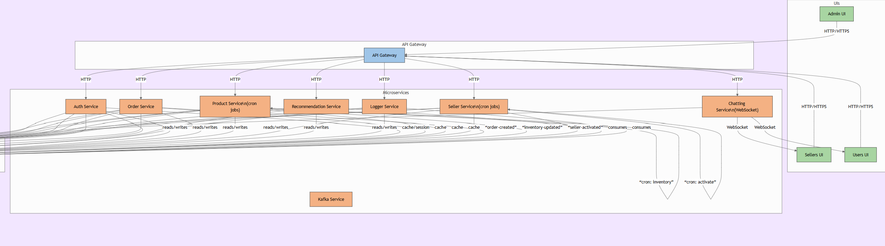
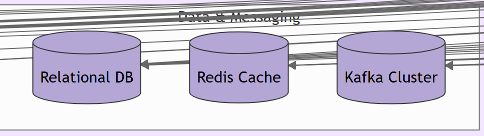
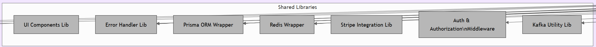
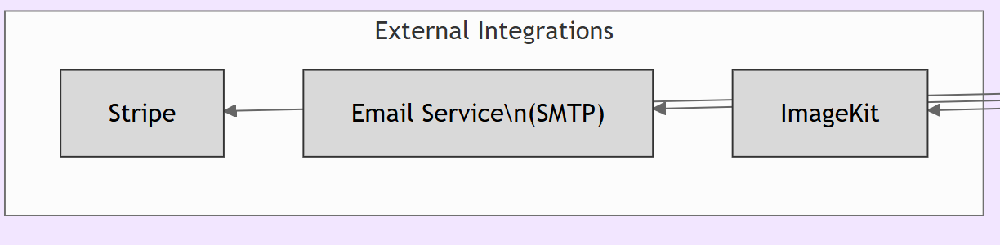

# 🛒 E-Commerce Multivendor Platform (Monorepo)

A modern, scalable, full-stack multivendor e-commerce platform built using **Nx Monorepo**, **Node.js**, **MongoDB**, **Redis**, **Kafka**, and **Prisma**. The system is designed with microservices architecture, event-driven communication, and reusable libraries, supporting multiple user roles and real-time features.
A scalable e-commerce platform with microservices architecture supporting multi-vendor operations, user management, product catalog, orders, and real-time chat.


---




## Features ✨

- **Multi-role UI**: Separate interfaces for Admin, Sellers, and Users
- **Microservices**: Decoupled services for auth, products, orders, etc.
- **Real-time Chat**: WebSocket-based communication
- **Event-driven**: Kafka for async event processing
- **Caching**: Redis for performance optimization
- **Payment Integration**: Stripe payment processing
- **Image Handling**: ImageKit integration for media management

---

## 📁 Project Structure
```bash

e_commerce_multivendor/
├── apps/
│   ├── admin-ui/                   # Admin dashboard
|   ├── admin-service/              # Admin services 
│   ├── api-gateway/                # API Gateway service
│   ├── auth-service/               # Authentication service
│   ├── chatting-service/           # Real-time chat service
│   ├── order-service/              # Order management
│   ├── product-service/            # Product catalog
│   ├── seller-service/             # Seller management
│   ├── sellers-ui/                 # Seller portal
│   |── users-ui/                   # Customer UI
│   ├── recommendation-service/     # Coming soon
│   └── logger-service/             # Coming soon
├── packages/
│   ├── components/        # Shared UI components
│   ├── error-handler/     # Common error handling
│   ├── libs/
│   │   ├── prisma/        # Prisma ORM wrapper
│   │   ├── redis/         # Redis client
│   │   └── stripe/        # Stripe integration
│   ├── middleware/        # Auth middleware
│   └── utils/kafka/       # Kafka utilities
└── prisma/                # Database schema
```

## Getting Started

### Prerequisites

- Node.js v16+
- Docker (for databases and Kafka)
- NX CLI (`npm install -g nx`)

### Installation

1. Clone the repository:
```bash
   git clone https://github.com/bhupesh227/E_Commerce_MultiVendor.git
   cd E_Commerce_MultiVendor
```
2. Install dependencies:
```bash
   npm i
```
3. Set up environment variables:
```bash
DATABASE_URL=
SMTP_PASS=
SMTP_USER=
SMTP_SERVICE=
SMTP_PORT=
SMTP_HOST=
REDIS_URL=
ACCESS_TOKEN_SECRET=
REFRESH_TOKEN_SECRET=
NEXT_PUBLIC_STRIPE_PUBLIC_KEY=
STRIPE_SECRET_KEY=
STRIPE_WEBHOOK_SECRET=
IMAGEKIT_PUBLIC_KEY=
IMAGEKIT_PRIVATE_KEY=
IMAGEKIT_URL_ENDPOINT=
KAFKA_API_SECRET=
KAFKA_API_KEY=
NEXT_PUBLIC_CHATTING_WEBSOCKET_URL=
NEXT_PUBLIC_SERVER_URL=
NEXT_PUBLIC_SELLER_SERVER_URL=
NEXT_PUBLIC_USER_UI_LINK=
```
4. Running the Application
```bash

npm run dev

# User UI (http://localhost:3000)
npm run user-ui

# Seller UI (http://localhost:3001)
npm run seller-ui

# Admin UI (http://localhost:3002)
npm run admin-ui
```

## TODOs & Notes

### Completed
- Product listing & sales ranking
- Admin/Seller/User UI
- Role-based authentication
- Stripe payment integration
- Redis caching
- Kafka 
- WebSocket for chatting

###  In Progress
- Logger-service
- Recommendation-service

## Contribution
Contributions are welcome! Please feel free to submit a Pull Request.

1. Fork the repository
2. Create your feature branch (`git checkout -b ...`)
3. Commit your changes (`git commit -m '...'`)
4. Push to the branch (`git push origin ...`)
5. Open a Pull Request

##

Made with ❤️ by @bhupesh227